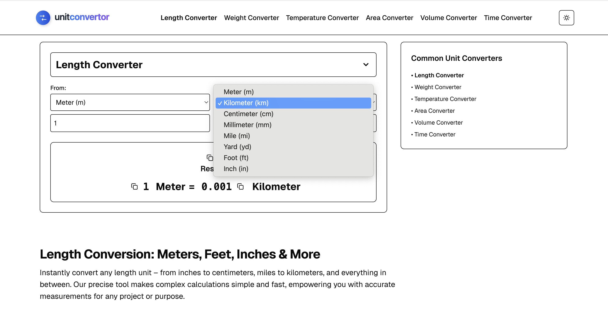

# UnitConvertor

A fast, user-friendly, and SEO-optimized unit conversion tool built with Next.js and Tailwind CSS. This project provides instant and accurate conversions across various categories like length, weight, temperature, and more.

 <!-- Add a screenshot of your app here -->

## ✨ Features

- **Instant Conversions**: Get results immediately as you type.
- **Multiple Categories**: Supports Length, Weight, Temperature, Area, Volume, and Time.
- **Dark/Light Mode**: Switch between themes for your viewing comfort.
- **Responsive Design**: Fully usable on both desktop and mobile devices.
- **SEO Optimized**: Clean URLs and dynamic metadata for better search engine ranking.
- **Clean Codebase**: Built with a professional project structure using Next.js App Router and TypeScript.

## 🚀 Tech Stack

- [Next.js](https://nextjs.org/) – React Framework for Production
- [Tailwind CSS](https://tailwindcss.com/) – A utility-first CSS framework
- [TypeScript](https://www.typescriptlang.org/) – Static type-checker for JavaScript
- [Prettier](https://prettier.io/) – Code formatter

## 🛠️ Getting Started

Follow these instructions to get a copy of the project up and running on your local machine for development and testing purposes.

### Prerequisites

You need to have [Node.js](https://nodejs.org/en/) (version 18.x or later) and [npm](https://www.npmjs.com/) installed on your machine.

### Installation

1.  **Clone the repository:**

    ```bash
    git clone https://github.com/Dpakkk/unitconvertor.git
    cd unitconvertor
    ```

2.  **Install dependencies:**

    ```bash
    npm install
    ```

3.  **Run the development server:**

    ```bash
    npm run dev
    ```

Open [http://localhost:3000](http://localhost:3000) with your browser to see the result.

## 🤝 Contributing

Contributions, issues, and feature requests are welcome! Feel free to check the [issues page](https://github.com/Dpakkk/unitconvertor/issues).

1.  Fork the Project
2.  Create your Feature Branch (`git checkout -b feature/AmazingFeature`)
3.  Commit your Changes (`git commit -m 'Add some AmazingFeature'`)
4.  Push to the Branch (`git push origin feature/AmazingFeature`)
5.  Open a Pull Request

## 📄 License

This project is licensed under the MIT License - see the [LICENSE.md](LICENSE.md) file for details.
